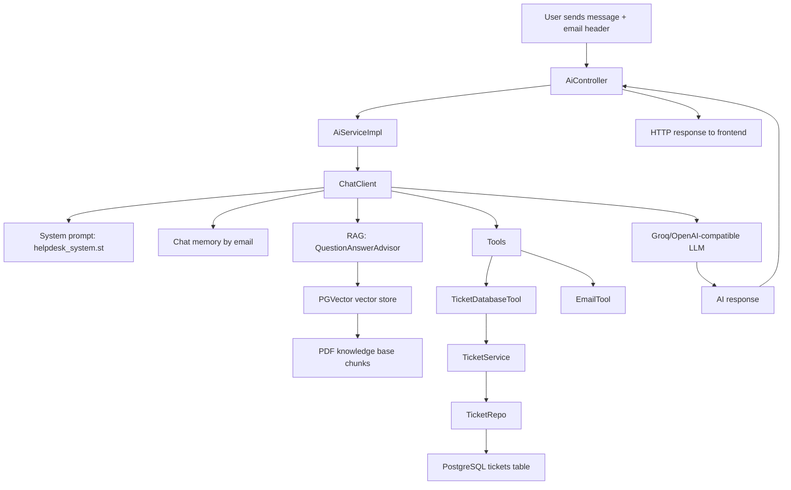

```mermaid
flowchart TD
    A["User sends message + email header"] --> B["AiController"]
    B --> C["AiServiceImpl"]
    C --> D["ChatClient"]
    D --> E["System prompt: helpdesk_system.st"]
    D --> F["Chat memory by email"]
    D --> G["RAG: QuestionAnswerAdvisor"]
    G --> H["PGVector vector store"]
    H --> I["PDF knowledge base chunks"]
    D --> J["Tools"]
    J --> K["TicketDatabaseTool"]
    J --> L["EmailTool"]
    K --> M["TicketService"]
    M --> N["TicketRepo"]
    N --> O["PostgreSQL tickets table"]
    D --> P["Groq/OpenAI-compatible LLM"]
    P --> Q["AI response"]
    Q --> B
    B --> R["HTTP response to frontend"]
```
